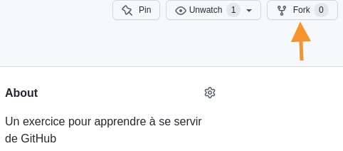

# Le commit exquis

Ce jeu est un dérivé du jeu littéraire _Le cadavre exquis_, mais en utilisant des dépôts _Git_ partagés (sur GitHub).

## Règles du jeu

1. Un·e premier·e joueur·se est désigné·e, il doit créer un fork de ce dépôt. 
2. Une fois le dépôt "forké", il·elle crée une copie locale de son fork avec la commande `git clone https://github.com/<username*>/commit-exquis` (où `<username*>` est remplacé par son nom d'utilisateur·trice GitHub).
4. Depuis la copie locale du dépôt, il·elle inspecte le dernier commit avec la commande `git log -n 1`, ce qui va lui révéler un morceau de phrase, par exemple: 
	```
	commit ba058f76a58a328d3bf6c171107fdc1aebbbcfc9 (HEAD -> master, origin/master)
	Author: raaaahman <sylvain@devindetails.com>
	Date:   Sun Apr 24 19:07:56 2022 +0200
	
   	 Un jour, alors que je me promenais, ...
    ```
3. Il·elle doit alors finir la phrase précédemment commencée, **sans ouvrir le fichier texte**. Cela peut être fait grâce à la commande `echo "je découvris une cabane abandonnée." >> histoire.md` (utiliser Git Bash sous Windows).
4. Il·elle commence ensuite une nouvelle phrase, et l'ajoute au fichier, toujours sans ouvrir d'éditeur, par exemple: `echo "Alors que j'en poussais la porte," >> histoire.md` (pensez à encadrer la phrase par des doubles guillemets, afin d'éviter l'interprétation de caractères spéciaux/mots-clés).
5. Il·elle enregistre les modifications avec la commande `git commit` et réécris le dernier morceau de phrase dans le message du commit, afin que le·la prochain·e joueur·se puisse le lire, par exemple `git commit -am "Alors que j'en poussais la porte, ..."`
6. Il·elle pousse ensuite les modifications enregistrées sur son dépôt, par exemple: `git push origin master`.
7. Sur GitHub, il·elle peut enfin faire une Pull Request vers le dépôt du joueur précédent, qu'il·elle a forké. . GitHub devrait automatiquement proposer le dépôt d'origine et le dépôt actuel (en 1), ainsi que les branches `master` de chacun de ces dépôts (en 2). 
8. Puis il·elle donne l'URL de son dépôt Git au·à la prochain·e joueur·se, qui recommence à l'étape 1, ajoute ses deux morceaux de phrases, et passe au·à la joueur·se d'après, et ainsi de suite...
9. Lorsque tous les joueur·se·s ont ajouté leurs phrases, ont peut lire le texte complet à tout le monde.
